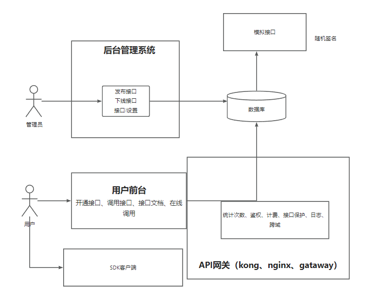

  

<h1 align="center">咖喱开放平台</h1>

## ✨特性：

- ###  🧵  免费调用各种特色API
- ###  🧦  平台简介无任何广告

- ###  🤡  有无数个琢磨不透的bug

## 🔧 技术栈：

### ⭐前端

- 框架：React
- 组件库：AntDesignPro+umi
- 特色组件：proComponent
- 请求：umi.request

### ⭐后端

- 语言：Java8
- 框架：SpringBoot
- 数据访问：Mybatis+Mybatis-plus
- 网关：Gateway
- 远程调用：Dubbo
- 注册中心：Nocos
- 项目管理：Maven
- 日志：slf4j
- 接口测试：postman

### ⭐存储

- 数据库：Mysql5.7

### ⭐部署
- 容器：Docker
- 服务器：CentOS

### 模块
* gali-api-biz：核心业务模块
* gali-api-common：通用模块
* gali-api-gateway：网关模块
* gali-api-interface：API模块
* gali-api-client-sdk：开发者SDK

> 暂未开发完，仍可期待!!!!

### 项目架构图

  

